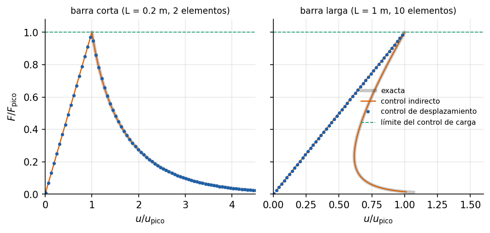

# Barra con daño: localización, retroceso y control indirecto

Ejemplo 5 del [manual de ejemplos](../../manuals/Example_manual.pdf) (capítulo
fuente: [`05_barra_dano_localizado.md`](../../manuals/sources/examples/05_barra_dano_localizado.md)).

**Qué demuestra.** Una barra a tracción con daño y ablandamiento
(`IsotropicDamage1D`) y un elemento un 5 % más débil, donde el daño se
localiza. Dos longitudes con el mismo tamaño de elemento: la corta baja sin
más y la larga retrocede (*snap-back*). Compara el control de carga (se detiene
en el pico), el de desplazamiento del extremo (no pasa el retroceso), el arco
cilíndrico (tampoco) y el control indirecto de desplazamiento
(`IndirectDisplacementSolver`) sobre el alargamiento del elemento débil, que
sigue las dos curvas exactas. Muestra también que un paso grande puede llevar
a otro equilibrio, con todos los elementos dañados.

**Cómo ejecutarlo.**

```bash
python examples/barra_dano_localizado/run.py
```

Los avisos "trazado detenido ... tras agotar max_steps" y los errores de
divergencia del control de carga son esperables: forman parte de lo que el
ejemplo muestra.

**Qué esperar.** El control indirecto reproduce la solución exacta a precisión
de máquina, con un solo elemento dañado, y en la barra larga retrocede hasta
0.616 veces el desplazamiento de pico.


