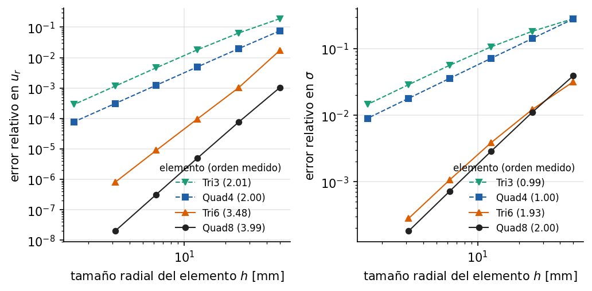

# Cilindro de pared gruesa: estudio de convergencia (Lamé)

Ejemplo 3 del [manual de ejemplos](../../manuals/Example_manual.pdf) (capítulo
fuente: [`03_cilindro_lame.md`](../../manuals/sources/examples/03_cilindro_lame.md)).

**Qué demuestra.** Construcción de un modelo sólido 2D con el API de Python,
presión sobre un contorno curvo con su carga consistente y estudio de
convergencia con Tri3, Quad4, Tri6 y Quad8 contra la solución de Lamé en
deformación plana. Mide los órdenes de convergencia en desplazamientos y en
esfuerzos.

**Cómo ejecutarlo.**

```bash
python examples/cilindro_lame/run.py
```

Tarda unos 20 s: resuelve 24 modelos.

**Qué esperar.** Órdenes en esfuerzos de 1 (lineales) y 2 (cuadráticos); en
desplazamientos, al menos 2 y 3, con superconvergencia nodal del Quad8
(orden ≈ 4).



Las funciones `modelo` y `carga_de_presion` de `run.py` las reutiliza el
ejemplo 4 ([`cilindro_elastoplastico/`](../cilindro_elastoplastico/)).
