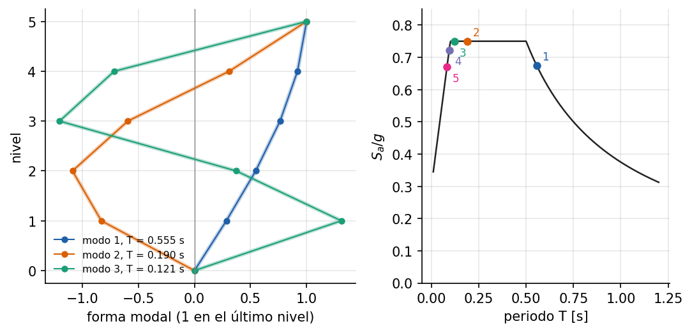

# Edificio de cinco niveles: análisis modal y espectro de respuesta

Ejemplo 7 del [manual de ejemplos](../../manuals/Example_manual.pdf) (capítulo
fuente: [`07_edificio_espectro.md`](../../manuals/sources/examples/07_edificio_espectro.md)).

**Qué demuestra.** Un marco de cinco niveles con `Frame2DEuler` (columnas sin
masa, losas rígidas que llevan la masa del piso), que idealiza un edificio de
cortante con solución cerrada. `ModalSolver` da los periodos y los modos;
`ResponseSpectrumSolver`, la respuesta a un espectro de diseño simplificado
con SRSS y CQC. Todo se compara con la combinación hecha a mano con los modos
analíticos, y se muestra que las derivas de entrepiso se combinan modo a modo.

**Cómo ejecutarlo.**

```bash
python examples/edificio_espectro/run.py
```

**Qué esperar.** Periodos y desplazamientos a menos de 2·10⁻⁴ de la solución
cerrada (la diferencia es la rigidez finita de las losas); el primer modo
reúne el 88 % de la masa; restar desplazamientos combinados subestima la
deriva del último entrepiso en un 5 %.


