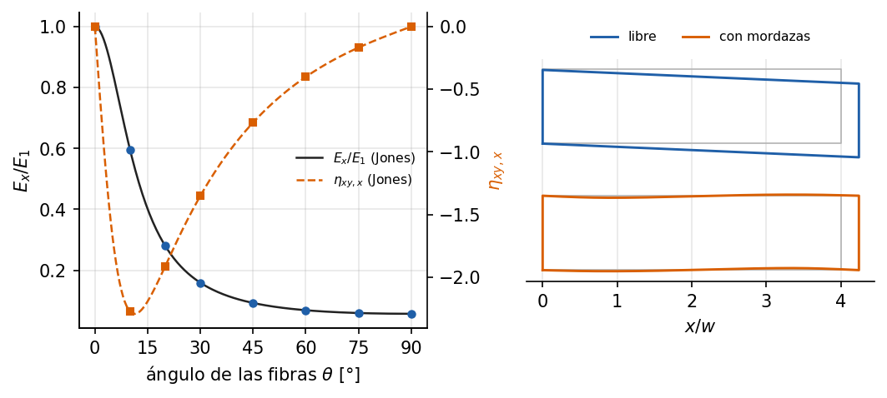

# Lámina ortótropa fuera de ejes: acoplamiento tracción-cortante

Ejemplo 10 del [manual de ejemplos](../../manuals/Example_manual.pdf) (capítulo
fuente: [`10_lamina_ortotropa.md`](../../manuals/sources/examples/10_lamina_ortotropa.md)).

**Qué demuestra.** Una tira de carbono-epoxi (T300/5208) con las fibras a un
ángulo θ del eje de carga, con `Orthotropic2D` y `Quad8`. Libre, bajo tracción
uniforme, reproduce a precisión de máquina las constantes aparentes de la
teoría de láminas (Jones): E_x, ν_xy y el coeficiente de influencia mutua
η_xy,x, el acoplamiento tracción-cortante. Sujeta con mordazas rígidas, la
tira se deforma en S y el módulo aparente crece: resultado numérico, con
convergencia de malla y acotado por los teoremas de energía,
E_x ≤ E_ap ≤ Q̄₁₁.

**Cómo ejecutarlo.**

```bash
python examples/lamina_ortotropa/run.py
```

**Qué esperar.** E_x(45°) = 16.7 GPa, el 9.2 % de E₁; η_xy,x(45°) = −0.77.
Con mordazas y L/w = 2, el módulo aparente excede a E_x en un 19 % a 45° y en
un 61 % a 30°; con L/w = 8, en un 1.2 % y un 3.6 %.


