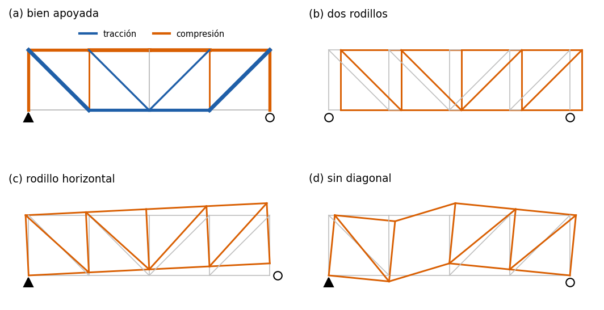

# Un modelo mal planteado: la red de seguridad del análisis estático

Ejemplo 11 del [manual de ejemplos](../../manuals/Example_manual.pdf) (capítulo
fuente: [`11_modelo_mal_planteado.md`](../../manuals/sources/examples/11_modelo_mal_planteado.md)).

**Qué demuestra.** Una armadura Pratt de cuatro paneles (`Truss2D`), bien
apoyada y con cuatro variantes erróneas: dos rodillos, un rodillo que impide
u_x en vez de u_y, una diagonal de menos, y la misma sin diagonal cargada
sólo en horizontal. `LinearSolver` rechaza las cuatro. Los mecanismos rígidos
lanzan `MechanismError` antes de resolver, con el movimiento libre descrito
("giro alrededor del eje z que pasa por (0, 0)"). Los internos lanzan
`IllPosedSystemError` al factorizar, por un pivote nulo, aunque la carga no
active el mecanismo. Todo se contrasta con la estática sin rigideces: el
rango de la matriz de equilibrio de los nudos y el núcleo de la de
compatibilidad (Maxwell; Pellegrino y Calladine). Incluye el error que
ninguna comprobación ve: el área en cm² tecleada como m².

**Cómo ejecutarlo.**

```bash
python examples/modelo_mal_planteado/run.py
```

**Qué esperar.** Bien apoyada: fuerzas axiales entre −200 y 212.1 kN, flecha
de 10.99 mm, ambas iguales a la estática a precisión de máquina (< 10⁻¹⁰). Un mecanismo en cada
variante errónea, y el mismo diagnóstico con SuperLU y con Pardiso.


