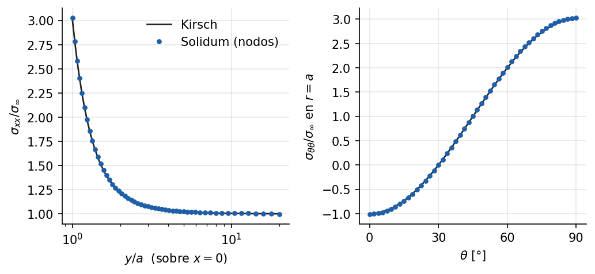

# Placa con agujero a tracción (Kirsch)

Ejemplo 2 del [manual de ejemplos](../../manuals/Example_manual.pdf) (capítulo
fuente: [`02_placa_agujero_kirsch.md`](../../manuals/sources/examples/02_placa_agujero_kirsch.md)).

**Qué demuestra.** Un cuarto de placa con agujero, malla estructurada de Quad4
generada con Gmsh y resuelta desde YAML con condiciones por grupo físico. Se
compara con la solución de Kirsch: factor de concentración de esfuerzos,
esfuerzo circunferencial en el borde del agujero y esfuerzos en todos los
puntos de Gauss. Separa el error de discretización del error de modelo.

**Cómo ejecutarlo.**

```bash
python examples/placa_agujero_kirsch/run.py     # resuelve y dibuja
python examples/placa_agujero_kirsch/malla.py   # sólo si se cambia la malla (requiere gmsh)
```

La malla `placa_agujero.msh` se versiona, así que resolver no requiere Gmsh.

**Qué esperar.** K_t ≈ 3.03, a menos del 1 % del valor de Kirsch (3), y
esfuerzo circunferencial en el borde entre −σ∞ y 3σ∞.


