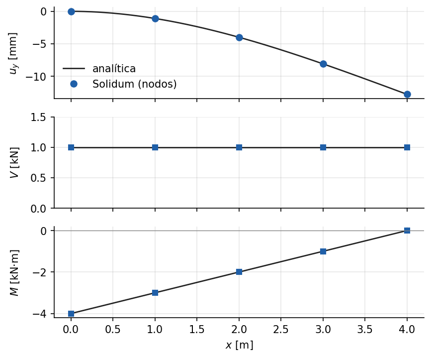

# Voladizo: marcos de Euler-Bernoulli y de Timoshenko

Ejemplo 1 del [manual de ejemplos](../../manuals/Example_manual.pdf) (capítulo
fuente: [`01_voladizo_marco.md`](../../manuals/sources/examples/01_voladizo_marco.md)).

**Qué demuestra.** Un voladizo con carga en el extremo resuelto desde YAML
(`Frame2DEuler`): desplazamientos, giros, reacciones y fuerzas internas N, V, M
coinciden con la solución analítica a precisión de máquina, y sus signos
ilustran la convención del API público. Una segunda parte, con el API de
Python, compara `Frame2DTimoshenko` con Euler-Bernoulli según la esbeltez y
muestra que el elemento no sufre bloqueo por cortante.

**Cómo ejecutarlo.**

```bash
python examples/voladizo_marco/run.py
```

Escribe `resultados.json` y las figuras `fig_*.pdf`/`fig_*.png`.

**Qué esperar.** Flecha en el extremo de 12.8 mm, igual a PL³/(3EI) salvo
redondeo; el cociente de flechas Timoshenko/Euler-Bernoulli sigue
1 + 0.78 (h/L)² en todo el rango de esbeltez.


