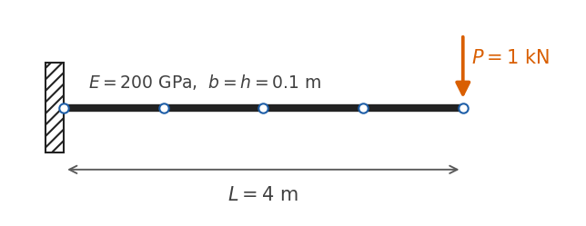
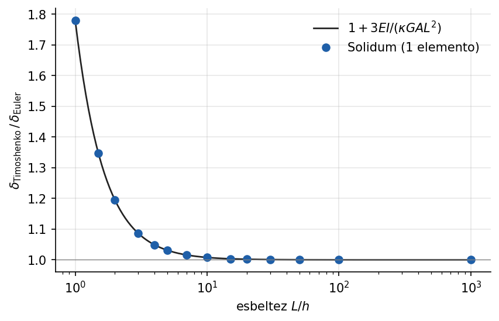

# Voladizo con carga en el extremo: marcos de Euler-Bernoulli y de Timoshenko

<!-- ejemplo: voladizo_marco -->

El voladizo con carga puntual en el extremo es el problema más sencillo con solución cerrada, y por eso es el primero. Sirve para tres cosas: comprobar que el modelo reproduce la teoría de vigas a precisión de máquina, aprender a leer los resultados (desplazamientos, reacciones y fuerzas internas) con la convención de signos de Solidum, y medir cuánto aporta la deformación por cortante según la esbeltez.

**Qué se aprende**

- Escribir un modelo YAML de marco 2D: nodos, material, elementos, apoyos y cargas.
- Leer desplazamientos, giros, reacciones y fuerzas internas $N$, $V$, $M$ del resultado.
- Interpretar el signo de las fuerzas internas 2D según la convención de viga del programa.
- Por qué la interpolación hermítica cúbica da la solución exacta con cargas nodales.
- Cuándo importa la deformación por cortante, y por qué el elemento de Timoshenko de Solidum no sufre bloqueo por cortante.

## Planteamiento

{#fig:esquema width=85%}

La viga de @fig:esquema tiene longitud $L = 4$ m, está empotrada en $x = 0$ y libre en $x = L$. La sección es cuadrada, $b = h = 0.1$ m, con área $A = 0.01$ m² y momento de inercia $I = bh^3/12 = 8.\overline{3}\times10^{-6}$ m⁴. El material es acero, $E = 200$ GPa. En el extremo libre actúa una carga $P = 1$ kN hacia abajo, es decir, en $-y$. Todas las magnitudes se dan en unidades SI coherentes: m, N y Pa.

## Solución analítica

Con $+y$ hacia arriba y giro antihorario positivo, la teoría de Euler-Bernoulli da la deformada y el giro

$$
u_y(x) = -\frac{P\,x^2\,(3L - x)}{6EI}, \qquad
\theta(x) = \frac{du_y}{dx} = -\frac{P\,x\,(2L - x)}{2EI},
$$

de modo que en el extremo libre la flecha es $\delta = PL^3/(3EI)$ y el giro $\theta_L = -PL^2/(2EI)$, negativo porque la sección gira en sentido horario.

Las fuerzas internas se obtienen cortando la viga en $x$ y aislando el tramo derecho. En la convención de viga del programa, la cara izquierda de ese tramo (normal saliente $-x$) lleva $V$ positivo hacia $+y$ y $M$ positivo en sentido horario. El equilibrio vertical del tramo da $V - P = 0$, y el de momentos respecto al corte da $M = -P(L - x)$:

$$
N(x) = 0, \qquad V(x) = +P, \qquad M(x) = -P\,(L - x).
$$

El cortante es positivo porque tiende a girar el diferencial en sentido horario. El flector es negativo en toda la viga, lo que indica tracción en la fibra superior, como corresponde a un voladizo cargado hacia abajo. El empotramiento reacciona con $R_y = +P$ hacia arriba y con un momento $M_z = +PL$ antihorario.

## Modelo en Solidum

El modelo completo es el archivo `examples/voladizo_marco/modelo.yaml`:

{{yaml:modelo.yaml}}

Los puntos que conviene notar:

- **Nodos y grados de libertad.** Cada nodo de un elemento [Frame2DEuler](../../../docs/specs/Frame2DEuler.md) tiene tres grados de libertad: `ux`, `uy` y `rz`. Los declara el elemento; el YAML sólo da coordenadas.
- **Material.** `Elastic1D` sólo necesita $E$. El área y la inercia son propiedades de la sección y van en cada elemento.
- **Empotramiento.** Fijar `ux`, `uy` y `rz` del nodo 1 impide los dos desplazamientos y el giro.
- **Carga.** `uy: -1000.0` en el nodo 5 es una fuerza de 1 kN en $-y$. Las cargas nodales se dan en ejes globales.
- **Solver.** `LinearSolver` resuelve $\mathbf K\,\mathbf u = \mathbf F$ una sola vez. Antes de factorizar comprueba que el modelo no sea un mecanismo, y después verifica el equilibrio de la solución.

El script `run.py` resuelve este YAML con el mismo proceso que `solidum.run_yaml`, pero conserva el dominio para poder indexar el vector de desplazamientos por nodo (`node.dofs["uy"]`). Las reacciones y las fuerzas internas vienen en el resultado: `res.reactions_by_node[1]` es un diccionario `{"ux": …, "uy": …, "rz": …}` y `res.element_forces[e].components["M"]` contiene el flector en los dos extremos del elemento `e`, en sus ejes locales.

## Resultados

[TABLA: Voladizo de Euler-Bernoulli: Solidum frente a la solución analítica.]
| Magnitud | Solidum | Analítica |
|---|---|---|
| Flecha en el extremo $\delta$ [mm] | {{r:A.flecha_fe_mm:.6f}} | {{r:A.flecha_analitica_mm:.6f}} |
| Giro en el extremo $\theta_L$ [rad] | {{r:A.giro_fe:.6e}} | {{r:A.giro_analitico:.6e}} |
| Reacción $R_y$ [N] | {{r:A.reaccion_Ry:.6f}} | {{r:A.P:.6f}} |
| Momento de reacción $M_z$ [N·m] | {{r:A.reaccion_Mz:.6f}} | $PL = 4000$ |
| Flector en el empotramiento $M(0)$ [N·m] | {{r:A.M_empotramiento:.6f}} | $-PL = -4000$ |
| Cortante $V$ [N] | {{r:A.V_empotramiento:.6f}} | {{r:A.P:.6f}} |

La mayor discrepancia relativa entre todas las magnitudes comparadas, incluidos los desplazamientos de los cinco nodos y las fuerzas internas en los dos extremos de cada elemento, es menor que $10^{-{{r:A.cota_orden}}}$: el redondeo de la aritmética de doble precisión.

{#fig:diagramas width=80%}

La @fig:diagramas muestra que la coincidencia no se limita al extremo. El resultado exacto tiene una explicación precisa: sin carga entre nodos, la ecuación de la viga $EI\,u_y'''' = 0$ tiene por solución un polinomio cúbico en cada tramo, y las funciones de forma hermíticas del elemento son justamente cúbicas. El método de elementos finitos reproduce entonces la solución exacta en los nodos, con cualquier número de elementos; los cuatro de este modelo sólo sirven para dibujar la deformada. Con una carga distribuida la solución exacta pasa a ser de cuarto grado y deja de estar contenida en el espacio de interpolación: los valores nodales siguen siendo exactos en el caso de la viga, pero la deformada entre nodos ya no.

Los signos de la tabla confirman la convención: el cortante sale positivo, el flector negativo (tracción arriba) y la reacción de momento positiva (antihoraria).

## Deformación por cortante: Timoshenko frente a Euler-Bernoulli

La teoría de Euler-Bernoulli supone que las secciones planas permanecen perpendiculares al eje deformado y desprecia la deformación por cortante. La de Timoshenko la incluye, y la flecha en el extremo del voladizo gana un término:

$$
\delta_T = \frac{PL^3}{3EI} + \frac{PL}{\kappa G A}, \qquad
\frac{\delta_T}{\delta_{EB}} = 1 + \frac{3EI}{\kappa G A L^2},
$$

donde $\kappa A$ es el área efectiva de cortante (parámetro `As` del elemento). Para una sección rectangular, con $I/A = h^2/12$, $G = E/[2(1+\nu)]$ y $\kappa = 5/6$, el cociente depende sólo de la esbeltez:

$$
\frac{\delta_T}{\delta_{EB}} = 1 + \frac{1+\nu}{2\kappa}\left(\frac{h}{L}\right)^2
= 1 + {{r:B.coef:.2f}}\left(\frac{h}{L}\right)^2 \quad (\nu = 0.3).
$$

El script repite el voladizo con una sección de $0.1\times0.2$ m y esbelteces $L/h$ de 1 a 1000, cada vez con **un solo elemento** [Frame2DTimoshenko](../../../docs/specs/Frame2DTimoshenko.md) y un solo Frame2DEuler. Este ejemplo usa el API de Python en vez del YAML: el modelo se construye nodo a nodo.

{{py:run.py#_flecha_punta}}

{#fig:timoshenko}

La @fig:timoshenko compara el cociente calculado con la expresión analítica. La discrepancia máxima es menor que $10^{-{{r:B.cota_orden}}}$. Dos lecturas prácticas:

- **Cuándo importa el cortante.** En $L/h = 10$ el cortante añade un {{r:B.aporte_cortante_Lh10_pct:.2f}} % a la flecha; en $L/h = 5$, un {{r:B.aporte_cortante_Lh5_pct:.2f}} %; en una viga tan corta como peraltada, $L/h = 1$, la flecha es {{r:B.cociente_Lh1:.2f}} veces la de Euler-Bernoulli. La regla habitual de usar Timoshenko por debajo de $L/h \approx 10$ sale directamente de esta curva.
- **Sin bloqueo por cortante.** En $L/h = 1000$ el cociente excede la unidad en {{r:B.exceso_Lh1000:.1e}}, como predice la teoría. Un elemento de Timoshenko con interpolación lineal independiente de flecha y giro, integrado de forma completa, se bloquea en ese límite: su rigidez a cortante domina y la flecha tiende a cero en vez de tender a la de Euler-Bernoulli. Frame2DTimoshenko usa la rigidez exacta de la viga de Timoshenko, escrita con el factor $\Phi = 12EI/(\kappa G A L^2)$; equivale a funciones de forma que dependen de $\Phi$ y se reducen a las hermíticas cuando $\Phi \to 0$. Por eso un elemento basta a cualquier esbeltez.

## Para seguir

- Cambiar un elemento del YAML por `Frame2DTimoshenko`, con `As: 0.00833333` y `nu: 0.3`. Como el cortante es constante, la flecha en el extremo debe crecer en $P\ell/(\kappa G A)$, con $\ell = 1$ m la longitud del tramo cambiado.
- Añadir peso propio con el bloque `gravity` y la `density` del material. La carga distribuida hace que el flector entre nodos sea parabólico; los valores de extremo de `element_forces` descuentan la carga nodal equivalente y siguen siendo exactos.
- El mismo voladizo modelado con sólidos 2D de cuatro nodos muestra el bloqueo por cortante que aquí no aparece. Lo documenta el benchmark de MacNeal-Harder en `tests/validation/test_slender_cantilever.py`.

**Archivos del ejemplo.** La carpeta `examples/voladizo_marco/` contiene el modelo `modelo.yaml`, el script `run.py`, los resultados en `resultados.json` y las figuras. Para regenerar resultados y figuras basta con ejecutar el script.
