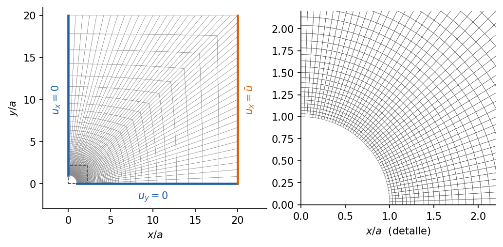
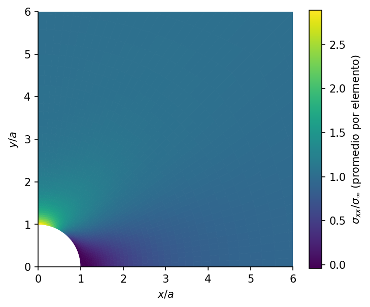

# Placa con agujero a tracción: concentración de esfuerzos de Kirsch

<!-- ejemplo: placa_agujero_kirsch -->

Un agujero circular en una placa traccionada multiplica por tres el esfuerzo en su borde. Es el caso clásico de concentración de esfuerzos, resuelto por Kirsch en 1898 para una placa infinita, y el primer problema bidimensional de este manual. A diferencia del voladizo, aquí la solución de elementos finitos ya no es exacta: el ejemplo enseña a medir cuánto se aparta de la analítica, dónde y por qué.

**Qué se aprende**

- Resolver una malla de Gmsh desde el YAML y aplicar condiciones de contorno por grupo físico.
- Aprovechar la doble simetría para modelar sólo un cuarto de la placa.
- Cargar con desplazamiento impuesto y obtener el esfuerzo nominal a partir de la reacción.
- Leer esfuerzos en los puntos de Gauss y recuperarlos en los nodos.
- Graduar la malla hacia el concentrador de esfuerzos.
- Distinguir el error de discretización, que baja al refinar, del error de modelo, que no.

## Planteamiento

Una placa de acero con un agujero de radio $a = 10$ mm se tracciona en la dirección $x$. Lejos del agujero el esfuerzo es uniaxial y uniforme, $\sigma_{xx} = \sigma_\infty$. La placa es delgada, con espesor de 10 mm, y trabaja en esfuerzo plano, con $E = 200$ GPa y $\nu = 0.3$.

El problema es simétrico respecto a los ejes $x$ e $y$, así que basta con el cuarto $x \ge 0$, $y \ge 0$. En los bordes de simetría se impone desplazamiento normal nulo: $u_x = 0$ sobre $x = 0$ y $u_y = 0$ sobre $y = 0$. El cuarto de placa mide $W = H = 20a$, lo bastante grande para que los bordes apenas perturben el campo del agujero.

{#fig:malla}

## Solución analítica

Para una placa infinita con un agujero libre de tracción, en coordenadas polares $(r, \theta)$ con $\theta$ medido desde el eje $x$, Kirsch obtuvo

$$
\begin{aligned}
\sigma_{rr} &= \frac{\sigma_\infty}{2}\left(1 - \frac{a^2}{r^2}\right)
 + \frac{\sigma_\infty}{2}\left(1 - \frac{4a^2}{r^2} + \frac{3a^4}{r^4}\right)\cos 2\theta,\\
\sigma_{\theta\theta} &= \frac{\sigma_\infty}{2}\left(1 + \frac{a^2}{r^2}\right)
 - \frac{\sigma_\infty}{2}\left(1 + \frac{3a^4}{r^4}\right)\cos 2\theta,\\
\sigma_{r\theta} &= -\frac{\sigma_\infty}{2}\left(1 + \frac{2a^2}{r^2} - \frac{3a^4}{r^4}\right)\sin 2\theta .
\end{aligned}
$$

En el borde del agujero sólo queda el esfuerzo circunferencial, $\sigma_{\theta\theta}(a, \theta) = \sigma_\infty\,(1 - 2\cos 2\theta)$. Vale $3\sigma_\infty$ en $\theta = 90°$, el punto $(0, a)$, y $-\sigma_\infty$ en $\theta = 0$: el borde del agujero se comprime en la dirección transversal a la carga. Sobre el eje $x = 0$,

$$
\sigma_{xx}(0, y) = \sigma_\infty\left(1 + \frac{a^2}{2y^2} + \frac{3a^4}{2y^4}\right),
$$

que decae de $3\sigma_\infty$ a $\sigma_\infty$ en pocos radios. El factor de concentración de esfuerzos es $K_t = \sigma_{xx}(0, a)/\sigma_\infty = 3$, independiente del tamaño del agujero y del material.

## Modelo en Solidum

**La malla.** El script `malla.py` genera la malla con el API de Python de Gmsh y la guarda en `placa_agujero.msh`, que se versiona junto al ejemplo; resolverlo no requiere Gmsh. La malla es estructurada y tiene dos zonas. Hasta $r = 5a$ es un anillo polar: líneas radiales rectas y circunferencias concéntricas, con elementos que crecen en progresión geométrica desde el agujero, donde el gradiente de esfuerzos es fuerte. De ahí al contorno, dos parches de transición. Todos los elementos son cuadriláteros [Quad4](../../../docs/specs/Quad4.md). La malla define grupos físicos con nombre (`Simetria_X`, `Simetria_Y`, `Borde_Carga`, `Agujero`), y el YAML los usa para aplicar las condiciones de contorno.

**La carga.** El YAML de Solidum todavía no admite tracciones distribuidas sobre un borde; el API de Python sí, con el método `compute_edge_traction` de los elementos sólidos. Aquí la carga es un desplazamiento impuesto $\bar u = 0.1$ mm en todo el borde $x = W$, como el que aplican las mordazas de una máquina de ensayo. El esfuerzo nominal lejano se obtiene después: $\sigma_\infty = R_x/(H\,t)$, con $R_x$ la reacción total en ese borde.

{{yaml:modelo.yaml}}

**Los esfuerzos.** El método de desplazamientos da los esfuerzos con más precisión en los puntos de Gauss que en los nodos. El script los evalúa en los cuatro puntos de Gauss de cada elemento con `gauss_states` y compara cada uno con el campo de Kirsch en ese mismo punto. Para los valores en la frontera, como $K_t$ o el esfuerzo en el borde del agujero, los extrapola a los nodos con el campo bilineal que pasa por los cuatro valores de Gauss y promedia entre los elementos que comparten el nodo. Es la recuperación nodal habitual de los programas comerciales. La función `calcular` de `run.py` hace todo el recorrido:

{{py:run.py#calcular}}

## Resultados

La reacción da $\sigma_\infty =$ {{r:sigma_inf_MPa:.2f}} MPa, algo menos que los 100 MPa de $E\,\bar u/W$, porque el agujero hace a la placa ligeramente más flexible.

[TABLA: Placa con agujero: Solidum frente a Kirsch. Errores relativos a $\sigma_\infty$.]
| Magnitud | Solidum | Kirsch |
|---|---|---|
| Factor de concentración $K_t$ | {{r:Kt:.3f}} | 3 |
| Mínimo de $\sigma_{\theta\theta}/\sigma_\infty$ en el borde | {{r:sigma_min_borde:.3f}} | $-1$ |
| Error máximo de $\sigma_{\theta\theta}$ en el borde | {{r:error_borde_max_pct:.1f}} % | — |
| Error máximo en puntos de Gauss con $r \le 2a$ | {{r:error_gauss_cercano_pct:.1f}} % | — |
| Error medio cuadrático en puntos de Gauss con $r \le 2a$ | {{r:rms_gauss_cercano_pct:.1f}} % | — |
| Error máximo en puntos de Gauss con $r > 5a$ | {{r:error_gauss_lejano_pct:.1f}} % | — |

{#fig:kirsch}

La @fig:kirsch muestra las dos distribuciones que interesan en diseño. El esfuerzo sobre el eje de simetría decae de tres veces el nominal a prácticamente el nominal en unos cuatro radios, y la concentración es local. En el borde, el esfuerzo circunferencial recorre la curva $1 - 2\cos 2\theta$ entre la compresión en $\theta = 0$ y el máximo en $\theta = 90°$. El factor de concentración calculado, {{r:Kt:.3f}}, está un {{r:error_Kt_pct:.1f}} % por encima de 3.

{#fig:campo width=58%}

## Dos fuentes de error

Los errores de la tabla no tienen un solo origen, y separarlos es lo que este ejemplo enseña.

- **Error de discretización.** Es el mayor, y se concentra junto al agujero, donde el esfuerzo varía más rápido. Un Quad4 representa los esfuerzos sólo de forma aproximadamente lineal dentro de cada elemento, y junto al agujero $\sigma_{xx}$ cae a la mitad en medio radio. Por eso el primer anillo de elementos tiene un espesor radial de sólo {{r:primer_elemento_radial_sobre_a:.3f}}$\,a$. Este error baja al refinar: al duplicar la densidad de la malla, el error en los puntos de Gauss cercanos se reduce a la mitad y $K_t$ se acerca a 3. El ejemplo 3 estudia esa convergencia en detalle.
- **Error de modelo.** Lejos del agujero el error se estanca en torno al 1 %, y refinar no lo reduce. Kirsch supone una placa infinita traccionada por un esfuerzo uniforme; el modelo es una placa finita de $20a \times 20a$ cuyo borde se desplaza uniformemente. Un desplazamiento uniforme no produce una tracción uniforme cuando el agujero perturba el campo. Las dos soluciones responden a problemas distintos, y la diferencia no es un error del programa.

La calidad de la malla también cuenta. Una primera versión de este ejemplo usaba dos parches transfinitos desde el agujero hasta el contorno, sin anillo polar. Sus líneas circunferenciales quedaban quebradas sobre la diagonal y los errores junto a ella eran bastante mayores. El anillo polar mantiene los elementos casi rectangulares donde más importa.

## Para seguir

- Refinar la malla cambiando `N_ARCO`, `N_ANILLO` y `N_EXT` en `malla.py`, regenerarla y volver a resolver: $K_t$ debe acercarse a 3 y el error junto al agujero debe bajar a la mitad con cada duplicación.
- Agrandar la placa, con `W` y `H`, para ver cómo baja el error lejano.
- Cambiar el agujero por una elipse de semiejes $b$ en $x$ y $c$ en $y$, y comparar con la solución de Inglis, $K_t = 1 + 2c/b$.

**Archivos del ejemplo.** La carpeta `examples/placa_agujero_kirsch/` contiene el generador de malla `malla.py`, la malla `placa_agujero.msh`, el modelo `modelo.yaml`, el script `run.py`, los resultados en `resultados.json` y las figuras.
