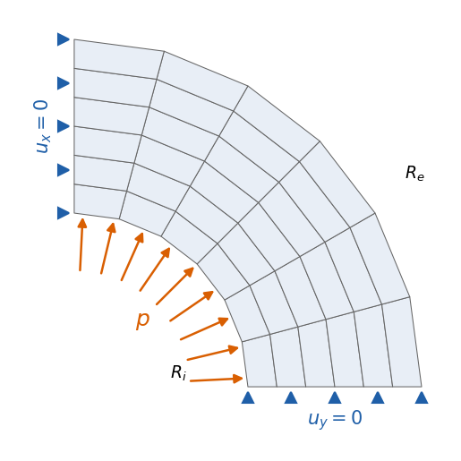
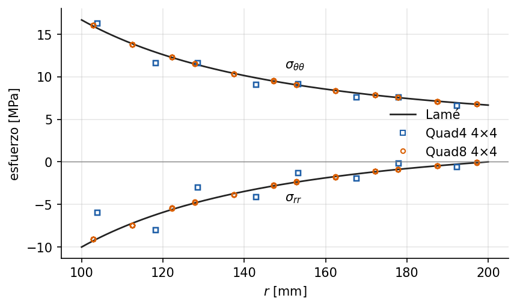

# Cilindro de pared gruesa: estudio de convergencia con el API de Python

<!-- ejemplo: cilindro_lame -->

Un modelo de elementos finitos converge a la solución exacta cuando la malla se refina, y lo hace con una rapidez que la teoría predice para cada elemento. Este ejemplo lo comprueba en el cilindro de pared gruesa bajo presión interna, cuya solución cerrada se debe a Lamé. El modelo se construye con el API de Python, sin YAML, lo que permite generar las mallas y repetir el cálculo en un bucle.

**Qué se aprende**

- Construir un modelo sólido 2D con el API: nodos, elementos, material y apoyos.
- Aplicar una presión sobre un contorno curvo con su vector de cargas consistente.
- Medir errores contra una solución analítica y estimar el orden de convergencia.
- Por qué el esfuerzo converge un orden más despacio que el desplazamiento.
- Cuánto más rinden los elementos cuadráticos que los lineales por grado de libertad.

## Planteamiento

Un tubo largo de acero, con radio interior $R_i = 100$ mm y exterior $R_e = 200$ mm, soporta una presión interna $p = 10$ MPa. Por ser largo y estar impedido axialmente, trabaja en deformación plana. El material tiene $E = 200$ GPa y $\nu = 0.3$. Por simetría se modela un cuarto de la sección, con $u_y = 0$ sobre el eje $x$ y $u_x = 0$ sobre el eje $y$.

{#fig:esquema width=55%}

## Solución analítica

La solución de Lamé en coordenadas polares es

$$
\sigma_{rr} = A - \frac{B}{r^2}, \qquad
\sigma_{\theta\theta} = A + \frac{B}{r^2}, \qquad
A = \frac{p R_i^2}{R_e^2 - R_i^2}, \quad B = \frac{p R_i^2 R_e^2}{R_e^2 - R_i^2},
$$

y, en deformación plana,

$$
u_r = \frac{1+\nu}{E}\left[(1 - 2\nu)\,A\,r + \frac{B}{r}\right], \qquad
\sigma_{zz} = \nu\,(\sigma_{rr} + \sigma_{\theta\theta}) = 2\nu A .
$$

El esfuerzo circunferencial es máximo en la cara interior, $\sigma_{\theta\theta}(R_i) =$ {{r:sigma_tt_Ri_MPa:.2f}} MPa, y el desplazamiento radial allí vale {{r:u_r_Ri_um:.3f}} μm. El esfuerzo axial $\sigma_{zz}$ es constante: Solidum lo calcula en el material, aunque el modelo 2D no lo muestra entre sus tres componentes.

## Modelo con el API de Python

La función `modelo` construye el cuarto de corona con $n \times n$ celdas en $(r, \theta)$ y cualquiera de los cuatro elementos del estudio: [Tri3](../../../docs/specs/Tri3.md) y Quad4, lineales, y Tri6 y [Quad8](../../../docs/specs/Quad8.md), cuadráticos. Los nodos intermedios de los elementos cuadráticos quedan sobre las circunferencias, así que su contorno interior es curvo; el de los lineales es un polígono inscrito.

{{py:run.py#modelo}}

**La presión.** El método `compute_edge_traction` de los elementos sólidos integra una tracción de dirección constante sobre una arista. Una presión no lo es: empuja en la dirección normal al contorno, que cambia a lo largo de una arista curva. La función `carga_de_presion` integra $\int_\Gamma \mathbf N^\top (-p\,\mathbf n)\,d\Gamma$ con tres puntos de Gauss sobre la geometría de cada arista, recta o parabólica:

{{py:run.py#carga_de_presion}}

Con el dominio y la carga, resolver es una línea: `LinearSolver(Assembler(domain)).solve(F)` devuelve el vector de desplazamientos.

## Estudio de convergencia

Cada elemento se resuelve en mallas de $2 \times 2$ a $64 \times 64$ celdas para los lineales, y hasta $32 \times 32$ para los cuadráticos, que llegan antes a errores muy pequeños. Se miden dos errores relativos:

- en desplazamientos, la media cuadrática del error de $u_r$ en todos los nodos;
- en esfuerzos, la media cuadrática del error de $(\sigma_{rr}, \sigma_{\theta\theta})$ en todos los puntos de Gauss.

Si el error se comporta como $e \approx C\,h^k$, en escala logarítmica es una recta de pendiente $k$, el **orden de convergencia**. La teoría del método predice, para una interpolación de grado $p$, orden $p+1$ en desplazamientos y $p$ en esfuerzos: los esfuerzos salen de derivar los desplazamientos y pierden un orden.

{#fig:convergencia}

[TABLA: Órdenes de convergencia medidos entre las dos mallas más finas y órdenes teóricos.]
| Elemento | $p$ | Desplazamiento, medido | Desplazamiento, teórico | Esfuerzo, medido | Esfuerzo, teórico |
|---|---|---|---|---|---|
| Tri3 | 1 | {{r:Tri3.orden_u:.2f}} | 2 | {{r:Tri3.orden_s:.2f}} | 1 |
| Quad4 | 1 | {{r:Quad4.orden_u:.2f}} | 2 | {{r:Quad4.orden_s:.2f}} | 1 |
| Tri6 | 2 | {{r:Tri6.orden_u:.2f}} | 3 | {{r:Tri6.orden_s:.2f}} | 2 |
| Quad8 | 2 | {{r:Quad8.orden_u:.2f}} | 3 | {{r:Quad8.orden_s:.2f}} | 2 |

Los esfuerzos convergen con el orden teórico en los cuatro elementos. Los desplazamientos lo alcanzan o lo superan. El Quad8 llega a orden 4: en mallas regulares, los valores nodales de algunos elementos convergen más rápido que el campo en su conjunto, un fenómeno conocido como **superconvergencia**. La teoría garantiza el orden $p+1$; lo que se mide por encima es un regalo de la regularidad de la malla, con el que no conviene contar en mallas arbitrarias.

## Lineales frente a cuadráticos

La @fig:convergencia muestra la diferencia práctica. Con la malla de $8 \times 8$ celdas, el error en esfuerzos del Quad4 es {{r:Quad4.error_s_n8_pct:.1f}} % y el del Quad8 {{r:Quad8.error_s_n8_pct:.2f}} %. Con la malla más fina, de {{r:Quad4.gdl_final}} grados de libertad, el Quad4 todavía queda en {{r:Quad4.error_s_final_pct:.2f}} %, peor que el Quad8 de $8 \times 8$ con sólo {{r:Quad8.gdl_n8}} grados de libertad. Cuando el campo de esfuerzos es suave, los elementos cuadráticos alcanzan una precisión dada con muchos menos grados de libertad.

{#fig:perfiles}

La @fig:perfiles explica el motivo. Con cuatro Quad4 en el espesor, el esfuerzo de cada elemento no puede seguir la variación $1/r^2$: sus puntos se dispersan alrededor de la curva, sobre todo en $\sigma_{rr}$ cerca de la cara interior. El Quad8, cuyo esfuerzo varía linealmente dentro del elemento, reproduce la solución con la misma malla.

## Para seguir

- Repetir el estudio con $\nu = 0.4999$. En deformación plana, casi incompresible, los elementos lineales con integración completa sufren **bloqueo volumétrico**: el error en desplazamientos crece mucho y la solución sale demasiado rígida.
- Adaptar la función `modelo` al Quad9, que añade al Quad8 el nodo central de cada celda, y comparar ambos.
- Distorsionar la malla desplazando al azar los nodos interiores. ¿Se mantienen los órdenes medidos? ¿Y la superconvergencia del Quad8?

**Archivos del ejemplo.** La carpeta `examples/cilindro_lame/` contiene el script `run.py`, que genera las mallas, los resultados en `resultados.json` y las figuras.
