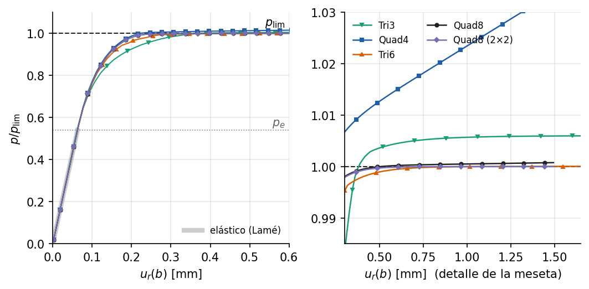

# Cilindro elastoplástico: primera fluencia, colapso y bloqueo volumétrico

<!-- ejemplo: cilindro_elastoplastico -->

El cilindro del ejemplo anterior, ahora de un material que fluye. Al aumentar la presión, la cara interior plastifica primero; la zona plástica avanza hacia fuera y, cuando alcanza la cara exterior, el tubo ya no admite más presión: ha llegado al colapso plástico. Las dos presiones que marcan ese recorrido tienen expresión cerrada, y el ejemplo las usa para verificar el material de von Mises, el solver de longitud de arco y el comportamiento de cinco elementos en régimen plástico.

**Qué se aprende**

- Usar un material elastoplástico (`VonMises2D`) en deformación plana.
- Trazar una curva presión-desplazamiento con el método de longitud de arco, que puede seguir la meseta del colapso.
- Declarar el primer paso como fracción de la carga, sin conocer de antemano los desplazamientos.
- Reconocer el **bloqueo volumétrico** en plasticidad y evitarlo con la elección del elemento.

## Planteamiento

La geometría, la malla y la carga son las del ejemplo 3: radio interior $a = 100$ mm, exterior $b = 200$ mm, un cuarto de sección por simetría y presión interna $p$. El acero es ahora elastoplástico perfecto, sin endurecimiento: $E = 200$ GPa, $\nu = 0.3$ y esfuerzo de fluencia $\sigma_y =$ {{r:sigma_y_MPa:.0f}} MPa, con el criterio de von Mises. El tubo trabaja en deformación plana.

## Soluciones analíticas

**Primera fluencia.** Mientras el material es elástico vale la solución de Lamé. El esfuerzo equivalente de von Mises es máximo en la cara interior, donde, con $\sigma_{zz} = \nu(\sigma_{rr} + \sigma_{\theta\theta})$,

$$
\sigma_{eq}(a) = \frac{p}{b^2 - a^2}\sqrt{3\,b^4 + (1 - 2\nu)^2\,a^4},
\qquad
p_e = \sigma_y\,\frac{b^2 - a^2}{\sqrt{3\,b^4 + (1 - 2\nu)^2\,a^4}} .
$$

Con los datos del ejemplo, $p_e =$ {{r:p_e_MPa:.2f}} MPa.

**Colapso.** En el colapso toda la pared fluye y el flujo plástico no cambia el volumen. En deformación plana eso impone $\sigma_{zz} = (\sigma_{rr} + \sigma_{\theta\theta})/2$, y el criterio de von Mises se reduce a $\sigma_{\theta\theta} - \sigma_{rr} = 2\sigma_y/\sqrt 3$. Integrando el equilibrio radial, $d\sigma_{rr}/dr = (\sigma_{\theta\theta} - \sigma_{rr})/r$, entre la cara interior, con $\sigma_{rr} = -p$, y la exterior, libre, resulta

$$
p_{\mathrm{lim}} = \frac{2}{\sqrt 3}\,\sigma_y \ln\frac{b}{a} .
$$

Vale {{r:p_lim_MPa:.2f}} MPa. Es una carga límite en sentido estricto: por encima de ella no existe equilibrio, y por los teoremas del análisis límite no depende de $E$ ni de $\nu$. La primera fluencia ocurre a una fracción {{r:p_e_sobre_p_lim:.3f}} de ella.

## Modelo en Solidum

El modelo reutiliza las funciones `modelo` y `carga_de_presion` del ejemplo 3, con el material plástico:

{{py:run.py#trazar}}

La carga de referencia es la presión de colapso, de modo que el factor de carga $\lambda$ que devuelve el solver es directamente $p/p_{\mathrm{lim}}$.

**Por qué longitud de arco.** El solver de Newton con control de carga ([NonlinearSolver](../../../docs/specs/NonlinearSolver.md)) impone el valor de $\lambda$ en cada paso. Cerca del colapso la curva se vuelve horizontal y más allá no hay equilibrio, así que ese esquema no puede recorrerla. El [ArcLengthSolver](../../../docs/specs/ArcLengthSolver.md) convierte $\lambda$ en una incógnita más y avanza una distancia fija, la longitud de arco, en el espacio de desplazamientos y carga. Así sigue la meseta con la carga prácticamente constante y el desplazamiento creciente. Como la meseta nunca llega a `max_lambda`, el recorrido termina al agotar `max_steps`, y el solver lo avisa. Si un paso cruzara `max_lambda`, el solver lo repetiría hasta llegar a ese valor exacto dentro del tramo recién recorrido: nunca impone la carga máxima sin haber seguido la curva hasta ella.

**El primer paso.** La longitud de arco es una longitud en unidades de desplazamiento, y quien plantea el modelo no conoce de antemano cuánto se desplazará la estructura. Por eso el primer paso se declara con `initial_dlambda`, como fracción de la carga de referencia: aquí {{r:dlambda:.2f}}, el {{r:dlambda_pct:.0f}} % de la presión de colapso. El solver lo convierte en longitud de arco con una resolución elástica, $\Delta l_1 = \Delta\lambda_1\,\lVert\mathbf K^{-1}\mathbf F_{\mathrm{ref}}\rVert$, que aquí da {{r:dl_primer_paso_m:.1e}} m. El valor por omisión es 0.1, y vale igual en cualquier sistema de unidades.

```callout Advertencia
El parámetro alternativo, `initial_dl`, fija la longitud de arco del primer paso directamente, en unidades de desplazamiento, y para elegirlo hay que conocer la escala del problema. Aquí, 0.1 m equivale a un primer paso de {{r:paso_excesivo.dlambda_equivalente:.0f}} veces la presión de colapso. Con ese valor el primer paso llega a un desplazamiento exterior de {{r:paso_excesivo.u_b_1_mm:.1f}} mm, {{r:paso_excesivo.u_b_1_sobre_elastico:.0f}} veces el elástico en el colapso: se salta toda la transición elastoplástica. Cinco pasos después el tubo se ha desplazado {{r:paso_excesivo.u_b_ultimo_mm:.0f}} mm, con una carga {{r:paso_excesivo.lambda_ultimo:.3f}} veces la de colapso. Ese exceso sobre $p_{\mathrm{lim}}$ no es un error del solver: es el Quad8 con integración completa, que a desplazamientos tan grandes también se bloquea (ver más abajo), y el solver sigue fielmente la curva del modelo discreto. En las mismas condiciones, el Quad8 con integración 2×2 se queda en {{r:paso_excesivo.lambda_ultimo_Quad8R:.4f}} veces la presión de colapso.
```

## Resultados

{#fig:curvas}

[TABLA: Cilindro elastoplástico. Error de la flexibilidad elástica frente a Lamé y carga relativa $p/p_{\mathrm{lim}}$ con desplazamientos exteriores de 0.5 y 1 mm.]
| Elemento | Grados de libertad | Error elástico | $p/p_{\mathrm{lim}}$ a 0.5 mm | $p/p_{\mathrm{lim}}$ a 1 mm |
|---|---|---|---|---|
| Tri3, $8 \times 8$ | {{r:Tri3.gdl}} | {{r:Tri3.error_flexibilidad:.1e}} | {{r:Tri3.lambda_05:.4f}} | {{r:Tri3.lambda_10:.4f}} |
| Quad4, $8 \times 8$ | {{r:Quad4.gdl}} | {{r:Quad4.error_flexibilidad:.1e}} | {{r:Quad4.lambda_05:.4f}} | {{r:Quad4.lambda_10:.4f}} |
| Tri6, $4 \times 4$ | {{r:Tri6.gdl}} | {{r:Tri6.error_flexibilidad:.1e}} | {{r:Tri6.lambda_05:.4f}} | {{r:Tri6.lambda_10:.4f}} |
| Quad8, $4 \times 4$ | {{r:Quad8.gdl}} | {{r:Quad8.error_flexibilidad:.1e}} | {{r:Quad8.lambda_05:.4f}} | {{r:Quad8.lambda_10:.4f}} |
| Quad8 con 2×2, $4 \times 4$ | {{r:Quad8R.gdl}} | {{r:Quad8R.error_flexibilidad:.1e}} | {{r:Quad8R.lambda_05:.4f}} | {{r:Quad8R.lambda_10:.4f}} |

La @fig:curvas y la tabla muestran tres tramos:

- **Elástico.** Todas las curvas arrancan sobre la recta de Lamé. Los elementos cuadráticos reproducen su pendiente con un error del orden de $10^{-5}$; el Tri3, el más rígido, la sobrestima un {{r:Tri3.error_flexibilidad:.1e}}.
- **Elastoplástico.** Las curvas se separan de la recta a partir de $p_e$, cuando la cara interior empieza a fluir, y se curvan a medida que la zona plástica avanza.
- **Colapso.** Tri6 y los dos Quad8 se aplanan sobre $p_{\mathrm{lim}}$: a 1 mm de desplazamiento la presión está a menos de $10^{-3}$ de la analítica. El Tri3 también forma una meseta, un {{r:Tri3.error_colapso:.1e}} por encima. El Quad4 no la forma: gana un {{r:Quad4.crecimiento_meseta:.1e}} de carga entre 0.5 y 1 mm, y sigue subiendo hasta el final del recorrido.

## Bloqueo volumétrico

La deformación plástica no cambia el volumen. En el colapso, el mecanismo del tubo es un flujo radial isocórico, y el modelo sólo puede seguirlo si sus funciones de forma admiten un campo de desplazamiento sin cambio de volumen en los puntos de integración que fluyen. El Quad4 con integración completa impone esa condición en sus cuatro puntos de Gauss, más de las que su interpolación bilineal puede satisfacer, y el mecanismo discreto resulta más rígido que el real. Es el **bloqueo volumétrico**, descrito por Nagtegaal, Parks y Rice en 1974 precisamente para el régimen totalmente plástico.

El síntoma se ve en el esfuerzo medio, $(\sigma_{xx} + \sigma_{yy} + \sigma_{zz})/3$. En el colapso exacto vale $\sigma_{rr} + \sigma_y/\sqrt3$, entre {{r:medio_exacto_min_MPa:.0f}} MPa en la cara interior y {{r:medio_exacto_max_MPa:.0f}} MPa en la exterior. Con 1 mm de desplazamiento exterior, el Quad4 tiene puntos de Gauss entre {{r:Quad4.medio_min_MPa:.0f}} y {{r:Quad4.medio_max_MPa:.0f}} MPa: una presión espuria, que el criterio de von Mises no limita porque sólo acota la parte desviadora del esfuerzo. El Tri6 y los dos Quad8 quedan dentro del intervalo exacto, salvo el error de discretización.

El bloqueo no es un error del programa ni del material: el mapeo de retorno respeta la superficie de fluencia en todos los puntos y el equilibrio se cumple. Es una propiedad del elemento, y se evita eligiéndolo bien:

- Los elementos cuadráticos, Tri6 y Quad8, no muestran bloqueo apreciable en este problema.
- El Quad8 con integración reducida 2×2, que impone la condición en cuatro puntos en vez de nueve, da la meseta más plana. En el API se elige con el argumento `quadrature="2x2"` del elemento, y en un YAML con elementos declarados uno a uno, con la clave `quadrature` de cada elemento.
- Solidum no tiene todavía formulaciones contra el bloqueo para el Quad4, como la B-barra o las mixtas desplazamiento-presión. Para plasticidad en deformación plana, o para materiales casi incompresibles, conviene usar elementos cuadráticos.

## Para seguir

- Añadir endurecimiento, `H > 0` en `VonMises2D`, y observar que la meseta se inclina: $p_{\mathrm{lim}}$ deja de ser una carga límite.
- Intentar superar $p_{\mathrm{lim}}$ con `NonlinearSolver` y control de carga. ¿Qué hace el solver cuando no hay equilibrio?
- Refinar la malla del Quad4. ¿Desaparece el bloqueo?

**Referencias.** R. Hill, *The Mathematical Theory of Plasticity*, Oxford, 1950, cap. V. J. C. Nagtegaal, D. M. Parks y J. R. Rice, "On numerically accurate finite element solutions in the fully plastic range", *Computer Methods in Applied Mechanics and Engineering* 4 (1974) 153-177. E. A. de Souza Neto, D. Perić y D. R. J. Owen, *Computational Methods for Plasticity*, Wiley, 2008, §7.5.

**Archivos del ejemplo.** La carpeta `examples/cilindro_elastoplastico/` contiene el script `run.py`, que construye el modelo con las funciones del ejemplo 3, los resultados en `resultados.json` y la figura.
