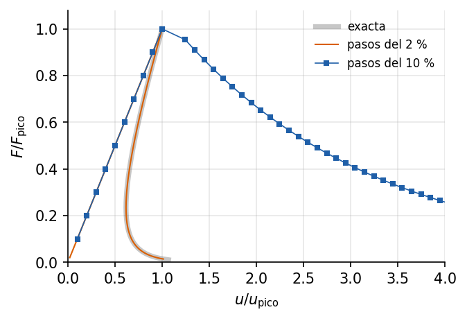

# Barra con daño: localización, retroceso y control indirecto

<!-- ejemplo: barra_dano_localizado -->

Una barra a tracción de un material que se ablanda: pasado el máximo, cuanto más se estira, menos fuerza soporta. Es el comportamiento del hormigón, de la roca o de la madera cuando se fisuran. El ejemplo muestra por qué ese tramo descendente no se puede recorrer controlando la carga, cómo el daño se concentra en una sola zona mientras el resto se descarga, y por qué una barra larga puede **retroceder**: desplazarse hacia atrás mientras la carga cae. Todo se compara con la solución exacta.

**Qué se aprende**

- Usar un material de daño con ablandamiento (`IsotropicDamage1D`).
- Por qué el control de carga se detiene en el pico, y el de desplazamiento en un retroceso.
- Seguir el retroceso con el **control indirecto de desplazamiento** (`IndirectDisplacementSolver`).
- Que con ablandamiento un paso demasiado grande puede llevar a otro equilibrio.

## Planteamiento

Una barra de sección $A =$ {{r:A_cm2:.0f}} cm² empotrada en un extremo y cargada con una fuerza $F$ en el otro, dividida en elementos `Truss2D` de longitud $h =$ {{r:h_m:.1f}} m. El material tiene $E =$ {{r:E_GPa:.0f}} GPa y un daño isótropo que empieza cuando la deformación alcanza $\kappa_0 =$ {{r:kappa_0:.0e}}, es decir, con un esfuerzo $\sigma_t = E\kappa_0 =$ {{r:sigma_t_MPa:.1f}} MPa. El elemento central es un {{r:debil_pct:.0f}} % menos resistente: es la imperfección que decide dónde se localiza el daño, como en un ensayo real decide la zona más débil de la probeta.

Se estudian dos barras con el mismo tamaño de elemento: una **corta**, de {{r:corta.L_m:.1f}} m ({{r:corta.n}} elementos), y una **larga**, de {{r:larga.L_m:.0f}} m ({{r:larga.n}} elementos).

## Solución analítica

**El material.** Con la variable de historia $\kappa$, la deformación máxima alcanzada, el daño y el esfuerzo son

$$
d(\kappa) = 1 - \frac{\kappa_0}{\kappa}\,e^{-\alpha(\kappa - \kappa_0)} \quad (\kappa > \kappa_0),
\qquad
\sigma = (1 - d)\,E\,\varepsilon ,
$$

con $\alpha =$ {{r:alpha:.0f}}. En carga, $\sigma = E\kappa_0\,e^{-\alpha(\varepsilon - \kappa_0)}$: el esfuerzo cae exponencialmente desde $\sigma_t$. En descarga, el material vuelve al origen por la secante, sin más daño.

**Localización.** Sin fuerzas de volumen, el equilibrio impone el mismo esfuerzo en toda la barra. La carga máxima la fija el elemento débil, $F_{\mathrm{pico}} = A\,E\,\kappa_{0w} =$ {{r:F_pico_kN:.1f}} kN, con $\kappa_{0w}$ su umbral. Pasado el pico el esfuerzo baja; el elemento débil sigue dañándose, pero los demás, que nunca llegaron a su umbral, se descargan elásticamente. Con la deformación del elemento débil $\varepsilon_w$ como parámetro, la respuesta exacta es

$$
F = A\,\sigma(\varepsilon_w),
\qquad
u = h\,\varepsilon_w + (L - h)\,\frac{\sigma(\varepsilon_w)}{E} .
$$

**Retroceso.** Justo después del pico, $d\sigma/d\varepsilon_w = -\alpha\,\sigma$, y el desplazamiento del extremo cambia a razón de

$$
\frac{du}{d\varepsilon_w} = h - (L - h)\,\alpha\,\kappa_{0w} .
$$

Si es negativa, el desplazamiento **disminuye** mientras la carga cae: la curva retrocede (*snap-back*). Ocurre cuando $(L/h - 1)\,\alpha\,\kappa_{0w} > 1$. Ese producto vale {{r:corta.criterio:.3f}} en la barra corta y {{r:larga.criterio:.3f}} en la larga: la corta baja sin más; la larga retrocede hasta $u =$ {{r:larga.u_min_exacto_sobre_pico:.3f}} $u_{\mathrm{pico}}$ antes de volver a avanzar.

El balance de energía lo explica. El elemento débil disipa en toda su rotura {{r:energia_J:.3f}} J, lo mismo en las dos barras porque tiene el mismo tamaño. En el pico, la barra corta tiene almacenados {{r:corta.energia_elastica_pico_J:.3f}} J de energía elástica y la larga {{r:larga.energia_elastica_pico_J:.3f}} J. Al romperse, toda esa energía elástica se libera, y la parte que el elemento no puede disipar tiene que devolverse a la carga exterior. Para eso el trabajo de la fuerza tiene que ser negativo, y con la fuerza a tracción eso sólo ocurre si el extremo retrocede. La barra corta no tiene exceso que devolver.

## Modelo en Solidum

La barra se construye elemento a elemento, con el central debilitado:

{{py:run.py#barra}}

Se resuelve con tres controles distintos:

- **Control de carga** ([NonlinearSolver](../../../docs/specs/NonlinearSolver.md) con una fuerza creciente hasta 1.2 veces la de pico). Impone la carga de cada paso, y por encima de $F_{\mathrm{pico}}$ no hay equilibrio.
- **Control de desplazamiento** (el mismo solver con el desplazamiento del extremo impuesto). La carga es ahora la reacción, y puede bajar; pero el desplazamiento impuesto sólo crece.
- **Control indirecto** ([IndirectDisplacementSolver](../../../docs/specs/IndirectDisplacementSolver.md)). Hace crecer en cada paso una magnitud elegida, aquí el alargamiento del elemento débil, y deja libres a la vez la carga y el desplazamiento del extremo. Es como se controla en laboratorio un ensayo de fractura, con la apertura de la fisura:

{{py:run.py#control_indirecto}}

La magnitud controlada se declara como una combinación de grados de libertad, $\mathbf c^\top\mathbf U$: aquí, $u_b - u_a$ entre los dos nodos del elemento débil. El primer paso es un {{r:dlambda_pct:.0f}} % de la carga de pico, y el solver mantiene constante ese incremento de alargamiento en todo el trazado.

## Resultados

{#fig:curvas}

[TABLA: Qué consigue cada control en cada barra. El error se mide frente a la solución exacta con la misma deformación del elemento débil.]
| Control | Barra corta | Barra larga |
|---|---|---|
| Carga | se detiene en el pico | se detiene en el pico |
| Desplazamiento del extremo | curva completa, error menor que $10^{-12}$ | se detiene en el pico, $u =$ {{r:larga.desplazamiento.u_final_sobre_pico:.3f}} $u_{\mathrm{pico}}$ |
| Indirecto | curva completa, error menor que $10^{-12}$ | curva completa, error menor que $10^{-12}$; retrocede hasta {{r:larga.indirecto.u_min_sobre_pico:.3f}} $u_{\mathrm{pico}}$ |

La @fig:curvas resume los tres comportamientos:

- **El control de carga** llega hasta $F_{\mathrm{pico}}$ en las dos barras y ahí termina con un error de divergencia (`{{r:larga.carga.excepcion}}`): el solver reduce el paso sin encontrar equilibrio por encima.
- **El control de desplazamiento** recorre toda la rama descendente de la barra corta, sobre la curva exacta. En la larga se detiene en el pico: a partir de ahí el camino de equilibrio sigue con desplazamientos *menores*. Con un desplazamiento impuesto mayor que el del pico, el único equilibrio que queda en el camino físico está al otro lado del lazo, con la carga casi nula, y el solver no llega a él.
- **El control indirecto** sigue las dos curvas exactas, incluido el retroceso de la larga, con un solo elemento dañado en todo el trazado. En las dos barras llega a una carga de {{r:larga.indirecto.F_final_sobre_pico:.3f}} veces la de pico en {{r:larga.indirecto.pasos}} pasos.

El arco cilíndrico de [ArcLengthSolver](../../../docs/specs/ArcLengthSolver.md), con el mismo primer paso, tampoco sigue el retroceso: en la barra larga termina en el pico con un error (`{{r:larga.cilindrico.excepcion}}`) sin haber retrocedido. Tras el pico, la parte de la barra que se descarga invierte casi por completo el sentido de su desplazamiento, y el criterio con que ese solver elige la solución, la más alineada con el paso anterior, la descarta.

```callout Advertencia
Con ablandamiento, el problema de cada paso puede tener más de una solución. Además de la física, en la que sólo se daña el elemento débil, hay otras en las que también se dañan elementos que en realidad se habrían descargado. Cuál encuentra el solver depende de su punto de partida. Si un paso sobrepasa el pico más que la imperfección que localiza el daño, aquí un {{r:debil_pct:.0f}} %, el solver puede converger a otra. Con pasos del {{r:dlambda_grande_pct:.0f}} % de la carga, el control indirecto de la barra larga acaba con los {{r:salto.danados}} elementos dañados y un desplazamiento que se aparta hasta {{r:salto.error_u:.0f}} veces $u_{\mathrm{pico}}$ de la solución exacta (@fig:salto). No es propio de este solver: el control de desplazamiento de la barra corta con {{r:salto_desplazamiento.pasos}} pasos termina con sus {{r:salto_desplazamiento.danados}} elementos dañados. La defensa es un paso pequeño cerca del pico; por eso `IndirectDisplacementSolver` no agranda el paso por omisión.
```

{#fig:salto}

## Para seguir

- Refinar la malla de la barra larga, con $h$ más pequeño. ¿Qué pasa con el retroceso? Con daño local la zona que se rompe mide siempre un elemento, y la energía disipada es proporcional a $h$: el resultado depende de la malla. Los modelos regularizados, o los de fisura cohesiva, que disipan una energía de fractura por unidad de área, corrigen esa dependencia.
- Reducir la imperfección del elemento débil al 1 % y repetir la advertencia. ¿Qué paso hace falta ahora?
- Controlar con el control indirecto el desplazamiento del extremo en vez del alargamiento del elemento débil. ¿Hasta dónde llega en la barra larga?

**Referencias.** R. de Borst, "Computation of post-bifurcation and post-failure behavior of strain-softening solids", *Computers & Structures* 25 (1987) 211-224. M. A. Crisfield, *Non-linear Finite Element Analysis of Solids and Structures*, vol. 1, Wiley, 1991, cap. 9. Z. P. Bažant y J. Planas, *Fracture and Size Effect in Concrete and Other Quasibrittle Materials*, CRC Press, 1998.

**Archivos del ejemplo.** La carpeta `examples/barra_dano_localizado/` contiene el script `run.py`, los resultados en `resultados.json` y las dos figuras.
