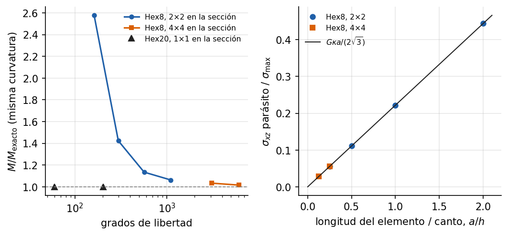

# Flexión pura de un prisma: el bloqueo por cortante del Hex8

<!-- ejemplo: flexion_pura_3d -->

El estado de flexión más simple, un prisma sometido a un momento constante, tiene solución exacta de la elasticidad tridimensional. Es una prueba exigente para un elemento sólido: debe representar a la vez la flexión y la deformación de la sección por el efecto de Poisson. El Hex20 la reproduce exactamente con un solo elemento. El Hex8 no: se vuelve demasiado rígido por una distorsión angular que la flexión pura no tiene. Es el **bloqueo por cortante**, el segundo tipo de bloqueo del manual después del volumétrico del ejemplo 4.

**Qué se aprende**

- Construir desde el API una malla estructurada de `Hex8` o `Hex20`.
- Imponer una curvatura con desplazamientos y medir el momento de reacción.
- Reconocer y cuantificar el bloqueo por cortante.
- Elegir el elemento en problemas dominados por la flexión.

## Planteamiento

Un prisma de acero de longitud $L =$ {{r:L_m:.0f}} m y sección cuadrada de lado $h =$ {{r:B_cm:.0f}} cm, con $E =$ {{r:E_GPa:.0f}} GPa y $\nu =$ {{r:nu:.1f}}, se flexiona en el plano $xz$ con una curvatura uniforme $\kappa =$ {{r:kappa:.2f}} $\mathrm{m}^{-1}$. El esfuerzo máximo es $\sigma_{\max} = E\kappa h/2 =$ {{r:sigma_max_MPa:.0f}} MPa.

## Solución analítica

En flexión pura la única componente del esfuerzo es $\sigma_{xx} = E\,\kappa\,z$; con la convención del proyecto, una curvatura positiva tracciona las fibras con $z > 0$ y equivale a un momento $M_y = E\kappa I =$ {{r:M_kNm:.3f}} kN·m, con $I = h^4/12$. Integrando las deformaciones se obtiene el desplazamiento exacto (Saint-Venant):

$$
u = \kappa\,x\,z,
\qquad
v = -\nu\,\kappa\,y\,z,
\qquad
w = -\frac{\kappa\,x^2}{2} + \frac{\nu\,\kappa}{2}\,(y^2 - z^2).
$$

Las secciones permanecen planas ($u$ es lineal en $z$), pero no conservan su forma: por el efecto de Poisson, las fibras traccionadas se estrechan y las comprimidas se ensanchan, y la sección se curva en sentido contrario al eje. Es la **curvatura anticlástica**, el término $\nu$ de $v$ y $w$. El desplazamiento es un polinomio de segundo grado en $x$, $y$, $z$.

## Modelo en Solidum

La malla se construye elemento a elemento sobre una rejilla de nodos; el `Hex20` usa los vértices y los medios de arista. Las condiciones de contorno reproducen la solución exacta sin añadir restricciones que ella no cumpla:

{{py:run.py#resolver}}

- En los dos extremos se impone el desplazamiento axial exacto: $u = 0$ en $x = 0$ y $u = \kappa L z$ en $x = L$. Es la curvatura impuesta.
- Los movimientos de sólido rígido que quedan libres (dos traslaciones y el giro alrededor del eje) se fijan en dos esquinas de la sección de la raíz, con los valores exactos. No se empotra la raíz: el empotramiento impediría la curvatura anticlástica y el estado dejaría de ser flexión pura.
- El momento se mide como la reacción del extremo, $M = \sum R_x\,z$ sobre sus nodos.

## Resultados

{#fig:bloqueo}

[TABLA: Momento necesario para imponer la curvatura, relativo al exacto, y esfuerzo cortante parásito en los puntos de Gauss. $a$ es la longitud del elemento.]
| Elemento | Malla | Grados de libertad | $a/h$ | $M/M_{\mathrm{exacto}}$ | $\sigma_{xz}/\sigma_{\max}$ |
|---|---|---|---|---|---|
| Hex8 | $5 \times 2 \times 2$ | {{r:Hex8_5x2x2.gdl}} | {{r:Hex8_5x2x2.a_sobre_h:.3f}} | {{r:Hex8_5x2x2.M_sobre_exacto:.4f}} | {{r:Hex8_5x2x2.sxz_sobre_smax:.3f}} |
| Hex8 | $10 \times 2 \times 2$ | {{r:Hex8_10x2x2.gdl}} | {{r:Hex8_10x2x2.a_sobre_h:.3f}} | {{r:Hex8_10x2x2.M_sobre_exacto:.4f}} | {{r:Hex8_10x2x2.sxz_sobre_smax:.3f}} |
| Hex8 | $20 \times 2 \times 2$ | {{r:Hex8_20x2x2.gdl}} | {{r:Hex8_20x2x2.a_sobre_h:.3f}} | {{r:Hex8_20x2x2.M_sobre_exacto:.4f}} | {{r:Hex8_20x2x2.sxz_sobre_smax:.3f}} |
| Hex8 | $40 \times 2 \times 2$ | {{r:Hex8_40x2x2.gdl}} | {{r:Hex8_40x2x2.a_sobre_h:.3f}} | {{r:Hex8_40x2x2.M_sobre_exacto:.4f}} | {{r:Hex8_40x2x2.sxz_sobre_smax:.3f}} |
| Hex8 | $40 \times 4 \times 4$ | {{r:Hex8_40x4x4.gdl}} | {{r:Hex8_40x4x4.a_sobre_h:.3f}} | {{r:Hex8_40x4x4.M_sobre_exacto:.4f}} | {{r:Hex8_40x4x4.sxz_sobre_smax:.3f}} |
| Hex8 | $80 \times 4 \times 4$ | {{r:Hex8_80x4x4.gdl}} | {{r:Hex8_80x4x4.a_sobre_h:.3f}} | {{r:Hex8_80x4x4.M_sobre_exacto:.4f}} | {{r:Hex8_80x4x4.sxz_sobre_smax:.3f}} |
| Hex20 | $1 \times 1 \times 1$ | {{r:Hex20_1x1x1.gdl}} | {{r:Hex20_1x1x1.a_sobre_h:.3f}} | {{r:Hex20_1x1x1.M_sobre_exacto:.4f}} | 0 |
| Hex20 | $5 \times 1 \times 1$ | {{r:Hex20_5x1x1.gdl}} | {{r:Hex20_5x1x1.a_sobre_h:.3f}} | {{r:Hex20_5x1x1.M_sobre_exacto:.4f}} | 0 |

**El Hex20 es exacto.** Con un solo elemento, {{r:Hex20_1x1x1.gdl}} grados de libertad, reproduce el momento, los desplazamientos y los esfuerzos de la solución exacta con un error menor que $10^{-10}$, y su esfuerzo cortante es nulo. No es casualidad: sus funciones de forma contienen todos los polinomios de segundo grado, y la solución exacta es uno de ellos.

**El Hex8 es demasiado rígido.** Para imponer la misma curvatura necesita {{r:Hex8_5x2x2.M_sobre_exacto:.2f}} veces el momento exacto en la malla más gruesa, y todavía un {{r:Hex8_80x4x4.error_M_pct:.1f}} % más con {{r:Hex8_80x4x4.gdl}} grados de libertad, cien veces más que el Hex20. Los desplazamientos, impuestos a través de la curvatura, salen casi exactos: el error está en la rigidez. Si la carga fuera una fuerza, ese exceso de rigidez daría desplazamientos menores que los reales.

## El bloqueo por cortante

Dentro de un Hex8 los desplazamientos son lineales en cada dirección, así que la flecha $w$ de cada elemento es lineal en $x$: el elemento no puede curvarse, sólo girar. El giro de la sección, $\partial u/\partial z = \kappa x$, crece en cambio a lo largo del elemento. La diferencia entre ambos es una distorsión angular que la flexión pura no tiene,

$$
\gamma_{xz} = \frac{\partial u}{\partial z} + \frac{\partial w}{\partial x} = \kappa\,(x - x_c),
$$

con $x_c$ el centro del elemento. En los puntos de Gauss, $x - x_c = \pm a/(2\sqrt3)$, y aparece un esfuerzo cortante **parásito**

$$
\sigma_{xz} = \frac{G\,\kappa\,a}{2\sqrt3},
\qquad
\frac{\sigma_{xz}}{\sigma_{\max}} = \frac{a/h}{2\sqrt3\,(1+\nu)} = {{r:factor_sxz:.3f}}\,\frac{a}{h} .
$$

La @fig:bloqueo lo confirma: los valores calculados caen sobre la recta, y sólo dependen de la longitud del elemento, no de cuántos elementos haya en la sección. La energía de ese cortante se suma a la de flexión y hace al elemento más rígido. Su cociente con la energía de flexión da el exceso de momento:

$$
\frac{M}{M_{\mathrm{exacto}}} - 1 \approx \frac{(a/h)^2}{2(1+\nu)} .
$$

Con $a/h =$ {{r:Hex8_5x2x2.a_sobre_h:.0f}} son {{r:Hex8_5x2x2.exceso_cortante:.3f}} de los {{r:Hex8_5x2x2.error_M:.3f}} medidos. El resto, {{r:Hex8_5x2x2.exceso_resto:.3f}} con dos elementos por lado de la sección y {{r:Hex8_40x4x4.exceso_resto:.3f}} con cuatro, no depende de $a$: es la sección, que con elementos lineales no representa la curvatura anticlástica, cuadrática en $y$, $z$. La prueba es que con $\nu = 0$, sin curvatura anticlástica, la malla de $5 \times 2 \times 2$ da exactamente $M/M_{\mathrm{exacto}} =$ {{r:nu_cero.M_sobre_exacto:.4f}} $= 1 + (a/h)^2/2$.

El error por cortante decrece como $(a/h)^2$: se reduce refinando **a lo largo** del prisma, y lentamente. La solución práctica es cambiar de elemento:

- Los elementos cuadráticos, Hex20 y Hex27, representan la flexión sin distorsión parásita.
- Existen formulaciones del Hex8 que eliminan el bloqueo: modos incompatibles, deformaciones mejoradas o integración reducida con control de los modos espurios. Solidum no las tiene todavía. El Hex8 admite integración reducida (`quadrature="hex_1x1x1"`), pero sin ese control es propenso a modos de energía nula (*hourglass*). En problemas dominados por la flexión conviene usar el Hex20.

Es el mismo fenómeno que el bloqueo volumétrico del ejemplo 4: el elemento lineal impone en sus puntos de integración una condición que su cinemática no puede cumplir, allí la de no cambiar de volumen y aquí la de no distorsionarse, y responde con una rigidez espuria.

## Para seguir

- Distorsionar la malla del Hex20, moviendo los nodos interiores. ¿Sigue siendo exacto? Su exactitud depende de que la geometría de cada elemento sea un paralelepípedo.
- Cargar el prisma en voladizo con una fuerza en el extremo y comparar la flecha del Hex8 y del Hex20 con la de la teoría de vigas.
- Repetir con el `Hex27`.

**Referencias.** S. P. Timoshenko y J. N. Goodier, *Theory of Elasticity*, 3.ª ed., McGraw-Hill, 1970 (flexión pura de barras prismáticas). R. H. MacNeal y R. L. Harder, "A proposed standard set of problems to test finite element accuracy", *Finite Elements in Analysis and Design* 1 (1985) 3-20. R. D. Cook, D. S. Malkus, M. E. Plesha y R. J. Witt, *Concepts and Applications of Finite Element Analysis*, 4.ª ed., Wiley, 2002.

**Archivos del ejemplo.** La carpeta `examples/flexion_pura_3d/` contiene el script `run.py`, los resultados en `resultados.json` y la figura.
