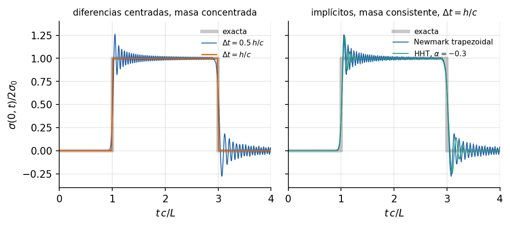

# Onda en una barra: integración explícita e implícita

<!-- ejemplo: onda_barra -->

Cuando una estructura recibe un golpe, la perturbación no llega a todas partes a la vez: viaja como una onda. Este ejemplo lanza una onda de esfuerzo por una barra y la sigue con tres integradores temporales. La solución exacta tiene frentes discontinuos, la prueba más exigente para un integrador, y muestra tres ideas prácticas: el límite de estabilidad del esquema explícito, por qué ese límite es también el paso más preciso, y qué hace la disipación numérica de los esquemas implícitos.

**Qué se aprende**

- Resolver un problema transitorio con `CentralDifferenceSolver`, `NewmarkSolver` y `HHTSolver`.
- Calcular el límite de estabilidad del esquema explícito.
- Por qué, en propagación de ondas, un paso menor que el límite puede empeorar el resultado.
- Qué corrige, y qué no, la disipación numérica de HHT-α.

## Planteamiento

Una barra de acero de longitud $L =$ {{r:L_m:.0f}} m y sección de {{r:A_cm2:.0f}} cm², con $E =$ {{r:E_GPa:.0f}} GPa y $\rho =$ {{r:rho:.0f}} kg/m³, está empotrada en $x = 0$. En $t = 0$ se aplica en el extremo libre una fuerza en escalón $F_0 =$ {{r:F0_kN:.0f}} kN, es decir, un esfuerzo $\sigma_0 = F_0/A =$ {{r:sigma0_MPa:.0f}} MPa. La barra se divide en {{r:N}} elementos `Truss2D` de $h =$ {{r:h_cm:.0f}} cm y se integra una vuelta completa de la onda.

## Solución analítica

La onda viaja a $c = \sqrt{E/\rho} =$ {{r:c_m_s:.1f}} m/s y tarda $L/c =$ {{r:t_cruce_us:.1f}} µs en recorrer la barra. El escalón lanza hacia el empotramiento un frente de tracción $\sigma_0$; al reflejarse en el extremo fijo, el esfuerzo se duplica. Según la solución de d'Alembert:

- **El esfuerzo en el empotramiento** es una onda cuadrada: nulo hasta $t = L/c$, $2\sigma_0$ hasta $3L/c$, nulo hasta $5L/c$, y así sucesivamente.
- **El extremo libre** avanza a velocidad constante hasta $2\,u_{\mathrm{est}}$ en $t = 2L/c$ y vuelve a cero en $4L/c$, con $u_{\mathrm{est}} = F_0 L/(EA) =$ {{r:u_est_um:.0f}} µm el desplazamiento estático: el conocido factor dinámico 2 de una carga súbita.

## Modelo en Solidum

La barra y la carga:

{{py:run.py#barra}}

Los tres integradores comparten la firma: ensamblador, tiempo final, paso $\Delta t$ y la carga como función del tiempo, `F_func(t)`, que aquí devuelve siempre el mismo vector (escalón):

{{py:run.py#integrar}}

El esquema de **diferencias centradas** es explícito: con la masa concentrada, cada paso sólo divide por la diagonal de la matriz de masas, sin resolver ningún sistema. Es **condicionalmente estable**: el paso tiene que cumplir $\Delta t \le 2/\omega_{\max}$, con $\omega_{\max}$ la mayor frecuencia de la malla. En una barra con masa concentrada, $\omega_{\max} \approx 2c/h$, y el límite es $\Delta t \approx h/c$: **el tiempo que tarda la onda en cruzar un elemento** (condición de Courant-Friedrichs-Lewy). Calculado con los autovalores de la malla, $\Delta t_{\mathrm{crit}} =$ {{r:dt_critico_sobre_h_c:.6f}} $h/c$ = {{r:paso_cfl_us:.3f}} µs. Con $\Delta t = 1.005\,h/c$ el cálculo diverge, y el solver se detiene con un error que lo explica.

Los esquemas implícitos de **Newmark** (regla trapezoidal) y **HHT-α** resuelven un sistema con la rigidez en cada paso, son **incondicionalmente estables** y usan la masa consistente. HHT-α añade una disipación numérica controlada por $\alpha$ que actúa sobre las frecuencias altas.

## Resultados

{#fig:onda}

[TABLA: Error máximo del desplazamiento del extremo libre (relativo a $u_{\mathrm{est}}$), sobrepaso del esfuerzo en el empotramiento sobre $2\sigma_0$, y oscilación de la cola lejos de los frentes (media cuadrática entre $1.5$ y $2.8\,L/c$, relativa a $2\sigma_0$).]
| Integrador | $\Delta t/(h/c)$ | Pasos | Error en $u$ | Sobrepaso de $\sigma$ | Oscilación de la cola |
|---|---|---|---|---|---|
| Diferencias centradas | 1 | {{r:explicito_1.pasos}} | $< 10^{-10}$ | $< 10^{-10}$ | $< 10^{-10}$ |
| Diferencias centradas | 0.5 | {{r:explicito_05.pasos}} | {{r:explicito_05.error_u:.3f}} | {{r:explicito_05.sobrepaso:.3f}} | {{r:explicito_05.cola_rms:.1e}} |
| Newmark | 1 | {{r:newmark_1.pasos}} | {{r:newmark_1.error_u:.3f}} | {{r:newmark_1.sobrepaso:.3f}} | {{r:newmark_1.cola_rms:.1e}} |
| HHT-α, $\alpha = -0.3$ | 1 | {{r:hht_1.pasos}} | {{r:hht_1.error_u:.3f}} | {{r:hht_1.sobrepaso:.3f}} | {{r:hht_1.cola_rms:.1e}} |
| Newmark | 4 | {{r:newmark_4.pasos}} | {{r:newmark_4.error_u:.3f}} | {{r:newmark_4.sobrepaso:.3f}} | {{r:newmark_4.cola_rms:.1e}} |
| HHT-α, $\alpha = -0.3$ | 4 | {{r:hht_4.pasos}} | {{r:hht_4.error_u:.3f}} | {{r:hht_4.sobrepaso:.3f}} | {{r:hht_4.cola_rms:.1e}} |

**El paso límite es exacto.** Con diferencias centradas, masa concentrada y $\Delta t = h/c$, los desplazamientos nodales coinciden con la solución exacta a precisión de máquina, y el esfuerzo del primer elemento sube a $2\sigma_0$ sin sobrepasarlo. No es casualidad: la masa concentrada hace que la malla vibre con frecuencias algo menores que las reales, las diferencias centradas producen el error contrario, y con ese paso los dos se cancelan exactamente. La onda discreta avanza justo un elemento por paso.

**Un paso menor es peor.** Con la mitad del paso, el frente llega a tiempo pero arrastra oscilaciones y el esfuerzo se pasa un {{r:explicito_05.sobrepaso_pct:.0f}} % del valor exacto. Es la **dispersión numérica**: las componentes de alta frecuencia del frente viajan en la malla más despacio que $c$ y se quedan atrás. Reducir el paso elimina el error temporal pero no el espacial, que ya no queda compensado.

**Los implícitos oscilan igual.** Newmark con el mismo paso da un sobrepaso parecido, del {{r:newmark_1.sobrepaso_pct:.0f}} %. La disipación de HHT-α casi no cambia el primer sobrepaso, pero apaga la cola de oscilaciones: su media cuadrática baja de {{r:newmark_1.cola_rms:.1e}} a {{r:hht_1.cola_rms:.1e}}. La disipación actúa sobre las frecuencias más altas, las que forman la cola; el sobrepaso del frente lo producen sobre todo frecuencias más bajas, que HHT está diseñado para respetar. Con un paso cuatro veces mayor los implícitos siguen siendo estables, pero el error en el desplazamiento crece hasta un {{r:newmark_4.error_u_pct:.0f}} %.

**Cuándo usar cada uno.** Para ondas e impactos, el explícito cerca de su límite es a la vez el más preciso y el más barato por paso. Los implícitos compensan cuando la respuesta la dominan los modos bajos, como la de un edificio ante un sismo (ejemplo 7): entonces el paso puede ser mucho mayor que el límite del explícito, que lo impondría el elemento más pequeño de la malla.

## Para seguir

- Refinar la malla a 200 elementos manteniendo el mismo $\Delta t$. ¿Qué le pasa al esquema explícito?
- Repetir el caso de Newmark con masa concentrada (`lumping="lumped"`). ¿Mejora o empeora el sobrepaso?
- Sustituir el escalón por un pulso suave, por ejemplo medio seno de duración $20\,h/c$. ¿Qué queda de la dispersión?

**Referencias.** K.-J. Bathe, *Finite Element Procedures*, 2.ª ed., 2014, cap. 9. T. J. R. Hughes, *The Finite Element Method*, Dover, 2000, cap. 9. T. Belytschko, W. K. Liu y B. Moran, *Nonlinear Finite Elements for Continua and Structures*, 2.ª ed., Wiley, 2014, cap. 6. H. M. Hilber, T. J. R. Hughes y R. L. Taylor, "Improved numerical dissipation for time integration algorithms in structural dynamics", *Earthquake Engineering and Structural Dynamics* 5 (1977) 283-292.

**Archivos del ejemplo.** La carpeta `examples/onda_barra/` contiene el script `run.py`, los resultados en `resultados.json` y la figura.
