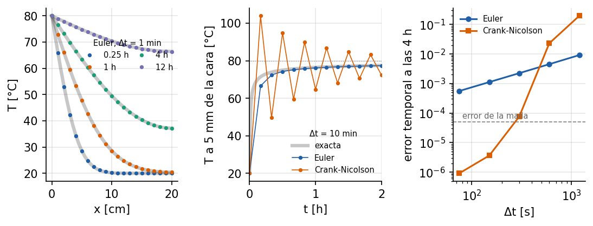

# Muro calentado bruscamente: conducción transitoria y el método θ

<!-- ejemplo: muro_termico -->

Un muro a temperatura ambiente recibe de pronto calor por una de sus caras: un fluido caliente, un incendio, el sol después de una noche fría. El calor penetra poco a poco y la temperatura de cada punto sube suavemente, sin pasarse nunca del valor de la cara. Este ejemplo resuelve ese choque térmico con el método θ y lo compara con la solución exacta. Enseña dos cosas que no se ven en los ejemplos estáticos: el esquema temporal más preciso no siempre es el más seguro, y un resultado numérico puede ser físicamente imposible aunque el cálculo no avise de nada.

**Qué se aprende**

- Resolver un transitorio térmico con `ThetaMethodSolver` y elementos `Quad4Thermal`.
- Elegir el parámetro θ: Euler implícito frente a Crank-Nicolson.
- Reconocer las oscilaciones de Crank-Nicolson y la violación del principio del máximo.
- Elegir entre capacidad concentrada y consistente.

## Planteamiento

Un muro de concreto de {{r:L_cm:.0f}} cm de espesor, con conductividad $k =$ {{r:k:.1f}} W/(m·K), densidad {{r:rho:.0f}} kg/m³ y calor específico {{r:cp:.0f}} J/(kg·K), está a $T_0 =$ {{r:T0:.0f}} °C. En $t = 0$ su cara interior pasa bruscamente a $T_s =$ {{r:Ts:.0f}} °C; la exterior no intercambia calor (adiabática). El muro se modela como una franja de {{r:N}} elementos `Quad4Thermal` de $h =$ {{r:h_mm:.0f}} mm: los bordes sin condición son adiabáticos, así que la franja representa cualquier porción del muro.

La difusividad es $\alpha = k/(\rho c) =$ {{r:alpha:.2e}} m²/s. El tiempo característico del muro entero es $L^2/\alpha =$ {{r:escala_h:.1f}} h; el de un elemento, $h^2/\alpha =$ {{r:h2_alpha_s:.1f}} s.

## Solución analítica

La serie de Carslaw y Jaeger para una placa con una cara a temperatura impuesta y la otra adiabática es

$$
\frac{T - T_s}{T_0 - T_s} = \sum_{n=0}^{\infty} \frac{4}{(2n+1)\,\pi}\,\sin(\lambda_n x)\,e^{-\alpha\lambda_n^2 t},
\qquad
\lambda_n = \frac{(2n+1)\,\pi}{2L} .
$$

Además, la ecuación del calor cumple el **principio del máximo**: sin fuentes internas, la temperatura de cualquier punto queda siempre entre la mínima y la máxima de los datos, aquí entre {{r:T0:.0f}} y {{r:Ts:.0f}} °C. Un valor fuera de ese intervalo no es impreciso: es imposible.

## Modelo en Solidum

El muro y la temperatura impuesta:

{{py:run.py#muro}}

La integración en el tiempo, con el esquema y la forma de la capacidad como parámetros:

{{py:run.py#integrar}}

La condición inicial, {{r:T0:.0f}} °C, contradice la temperatura impuesta en la cara. Solidum lo avisa y lo acepta: es un choque térmico, una discontinuidad en $t = 0$ que el modelo puede representar.

**El método θ.** Con la capacidad $\mathbf C$ y la conductividad $\mathbf K$ de la malla, cada paso resuelve

$$
\frac{\mathbf C}{\Delta t}\left(\mathbf T_{n+1} - \mathbf T_n\right) + \mathbf K\left[\theta\,\mathbf T_{n+1} + (1-\theta)\,\mathbf T_n\right] = \mathbf F .
$$

Con $\theta = 1$ es **Euler implícito**: de primer orden, pero L-estable, es decir, amortigua por completo en cada paso los modos de temperatura más rápidos. Con $\theta = 1/2$ es **Crank-Nicolson**: de segundo orden, pero no L-estable; esos modos rápidos no se amortiguan, cambian de signo en cada paso. El valor por omisión de Solidum es $\theta = 1$.

## Resultados

{#fig:muro}

[TABLA: Error temporal a las 4 h (máximo a lo ancho del muro, relativo a $T_s - T_0$), frente a una solución con $\Delta t = 1$ s en la misma malla.]
| $\Delta t$ | Euler implícito | Crank-Nicolson |
|---|---|---|
| 20 min | {{r:euler_por_paso.1200.temporal:.1e}} | {{r:cn_por_paso.1200.temporal:.1e}} |
| 10 min | {{r:euler_por_paso.600.temporal:.1e}} | {{r:cn_por_paso.600.temporal:.1e}} |
| 5 min | {{r:euler_por_paso.300.temporal:.1e}} | {{r:cn_por_paso.300.temporal:.1e}} |
| 2.5 min | {{r:euler_por_paso.150.temporal:.1e}} | {{r:cn_por_paso.150.temporal:.1e}} |
| 1.25 min | {{r:euler_por_paso.75.temporal:.1e}} | {{r:cn_por_paso.75.temporal:.1e}} |

**Euler implícito sigue la solución exacta** a todas las horas (@fig:muro, izquierda), y nunca sale del intervalo físico. Su error temporal se reduce a la mitad cada vez que el paso se divide por dos: orden {{r:orden_euler:.2f}}.

**Crank-Nicolson es mucho más preciso con pasos pequeños.** Su error baja con el cuadrado del paso, orden {{r:orden_cn:.2f}}, y con 2.5 minutos ya es mucho menor que el error de la malla, {{r:error_espacial:.0e}}: afinar más el paso no serviría sin afinar también la malla.

**Pero con pasos grandes oscila.** Con $\Delta t = 10$ min, el primer paso lleva el punto situado a 5 mm de la cara a {{r:cn_600.T_max:.0f}} °C, por encima de los {{r:Ts:.0f}} °C de la cara (@fig:muro, centro). A partir de ahí la temperatura alterna por encima y por debajo de la solución durante horas. Es el modo rápido que el choque térmico excita y que Crank-Nicolson no amortigua. A las 4 h todavía no se ha extinguido, y con 10 y 20 minutos de paso Crank-Nicolson resulta peor que Euler implícito. Euler implícito, con el mismo paso, queda entre {{r:euler_600.T_min:.0f}} y {{r:euler_600.T_max:.0f}} °C.

```callout Advertencia
Ante un cambio brusco —un choque térmico, una temperatura impuesta que salta— Crank-Nicolson necesita pasos pequeños frente al tiempo característico de un elemento, $h^2/\alpha$. En este muro, con 5 minutos ({{r:cn_300.pasos_por_h2_alpha:.0f}} veces $h^2/\alpha$) todavía llega a {{r:cn_300.T_max:.1f}} °C; con 2.5 minutos ({{r:cn_150.pasos_por_h2_alpha:.0f}} veces) ya no sale del rango. Con pasos mayores produce temperaturas imposibles sin que el cálculo falle ni avise. Euler implícito es menos preciso pero nunca oscila, y por eso es el valor por omisión.
```

**Capacidad concentrada o consistente.** La capacidad consistente reparte la inercia térmica entre nodos vecinos, y con pasos muy pequeños eso también viola el principio del máximo. Con $\Delta t = 1$ s, menor que $h^2/(6\alpha) =$ {{r:umbral_consistente_s:.1f}} s, el muro se **enfría** junto a la cara antes de calentarse: llega a {{r:consistente_1.T_min:.2f}} °C, por debajo de su temperatura inicial. Con $\Delta t = 8$ s el efecto desaparece, y con la capacidad concentrada no aparece con ningún paso. Es la razón de que la concentrada sea el valor por omisión.

## Para seguir

- Probar θ = 2/3 (Galerkin). ¿Oscila con $\Delta t = 10$ min?
- Integrar con el esquema explícito, θ = 0, y $\Delta t = 30$ s. Su límite de estabilidad con capacidad concentrada es $h^2/(2\alpha)$.
- Imponer en la cara un ciclo diario de temperatura con el argumento `dirichlet_func` del solver, y medir hasta qué profundidad llega la oscilación.

**Referencias.** H. S. Carslaw y J. C. Jaeger, *Conduction of Heat in Solids*, 2.ª ed., Oxford, 1959, §3.3. T. J. R. Hughes, *The Finite Element Method*, Dover, 2000, cap. 8.

**Archivos del ejemplo.** La carpeta `examples/muro_termico/` contiene el script `run.py`, los resultados en `resultados.json` y la figura.
